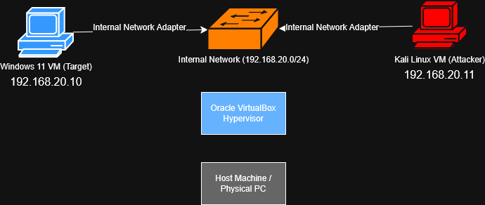

# Threat Telemetry Lab (Splunk + Sysmon)

**One-liner:** Built an isolated VirtualBox lab (Win11 + Kali) and ingested Sysmon into Splunk to triage process + network telemetry (suspicious parent/child execution, C2-style port **4444**).

**Stack:** Splunk • Sysmon • VirtualBox • Windows 11 • Kali Linux • PowerShell • Nmap • Metasploit/msfvenom • Python (`http.server`)  
**Use case:** Simulate attacker activity → generate Sysmon telemetry → hunt/triage in Splunk using SPL

## What I Built (Flow)
1. Created a **segmented VirtualBox lab** (Internal Network) with **Windows 11 target** + **Kali attacker**.
2. Installed **Sysmon** (high-fidelity endpoint telemetry) and forwarded logs into **Splunk**.
3. Simulated attacker TTPs (recon + payload + session) to produce real telemetry.
4. Investigated activity in Splunk (SPL) to trace **execution → child process behavior → network callbacks**.

## Outcomes (Measurable)
- **Repeatable sandbox:** snapshots + clean baselines for safe testing and quick rollback  
- **High-fidelity visibility:** Sysmon-backed process + network telemetry indexed in Splunk  
- **Triage-ready findings:** identified suspicious **parent/child execution** and **C2-style port 4444** activity

## Screenshots / Evidence

### Lab Architecture Diagram

### Network Telemetry (Suspicious Port 4444)

### Process Telemetry (Suspicious Parent/Child)

## Skills Demonstrated
- **Detection Engineering (Sysmon telemetry + Splunk SPL)**
- **Threat Triage / Investigation (process + network analysis)**
- **Virtualization & Network Segmentation (VirtualBox internal networking)**
- **Threat Simulation (nmap, msfvenom, Metasploit)**
- **Operational Hygiene (snapshots + SHA-256 integrity checks)**

## Next Improvements
- Build correlation searches (execution → immediate outbound connection) to reduce noise.
- Create a Splunk triage dashboard for process/network/file activity.
- Add NSM layer (Suricata/Zeek/Security Onion) for defense-in-depth correlation.

## Resources
- **Full Walkthrough:** [docs/full-walkthrough.md](docs/full-walkthrough.md)
